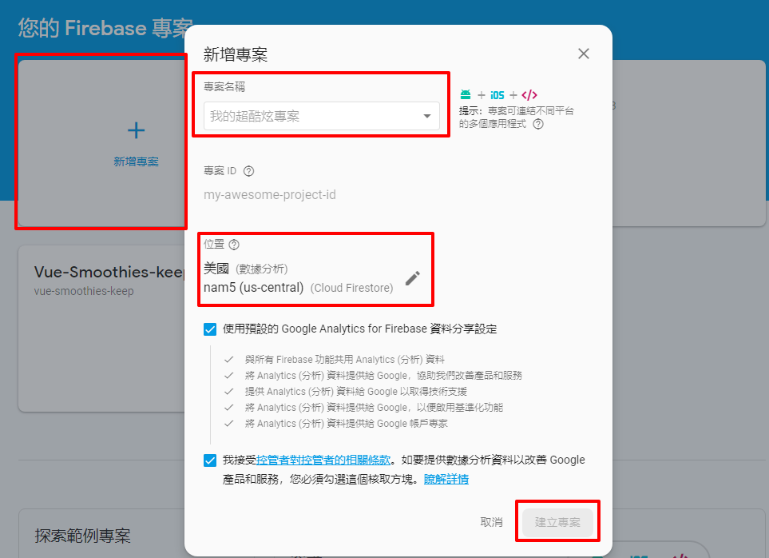
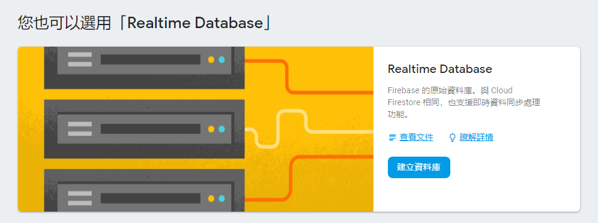

# Module重點
配合firebase，將前兩章的burger builder透過api service強化功能
1. [Firebase](#firebase)
2. [Axios設置](#axios設置)
3. [CSS Spinner](#css-spinner)


## Firebase
Google的雲端平台，提供掛載API或DB等服務。


首先，先建立專案  
點選`新增專案`後，輸入專案名稱和伺服器位置，並點選`建立專案`


選擇`Realtime Database`，並選擇測試模式


## Axios設置
安裝套件並設定config
```
// axios-orders.js

import axios from 'axios';

const instance = axios.create({
    baseURL: 'https://burger-builder-d6e3d.firebaseio.com/'
});

export default instance;
```

在burger builder引入並呼叫
```
// BuregerBuilder.js
const order = {
    ingredients: this.state.ingredients,
    price: this.state.totalPrice.toFixed(2),
    customer: {
        name: 'Max',
        address: {
            street: 'ABC',
            zipCode: '104',
            country: 'Taiwan'
        },
        email: 'myemail@test.com'
    },
    deliveryMethod: 'fastest'
};

axios.post('/orders.json', order)
    .then(response => console.log(response))
    .catch(error => console.log(error))
```

## CSS Spinner
利用第三方library建立讀取動畫，參考[這裡](https://projects.lukehaas.me/css-loaders/)

CSS內容如`Spinner.css`，之後修改BurgerBuilder和Modal判斷loading出現的時機
```
// BurgerBuilder.js

purchaseContinueHandler = () =>
{
    this.setState({ loading: true });
    const order = {
        ingredients: this.state.ingredients,
        price: this.state.totalPrice.toFixed(2),
        customer: {
            name: 'Max',
            address: {
                street: 'ABC',
                zipCode: '104',
                country: 'Taiwan'
            },
            email: 'myemail@test.com'
        },
        deliveryMethod: 'fastest'
    };

    axios.post('/orders.json', order)
        .then(response =>
        {
            this.setState({ loading: false, purchasing: false })
        })
        .catch(error =>
        {
            this.setState({ loading: false, purchasing: false })
        })
}

let orderSummary = <OrderSummary
    ingredients={this.state.ingredients}
    price={this.state.totalPrice}
    purchaseCancelled={this.purchaseCancelHandler}
    purchaseContinued={this.purchaseContinueHandler} />;

if (this.state.loading)
{
    orderSummary = <Spinner />
}
```
Modal內的shouldComponentUpdate需要多判斷`nextProps.children !== this.props.children;`，畫面才會重新render
```
// Modal
shouldComponentUpdate(nextProps, nextState)
{
    return nextProps.show !== this.props.show || nextProps.children !== this.props.children;
}
```